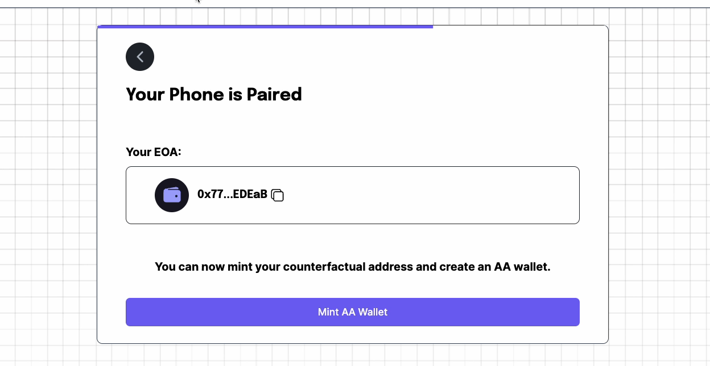
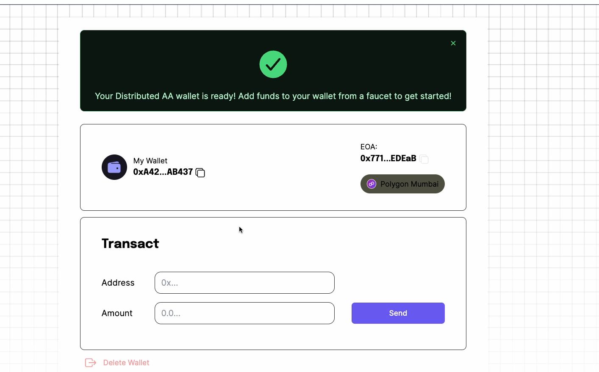

## AA Demo Frontend
This is the frontend of the AA demo project. It is a next app that uses the ERC-4337 stackup sdk.Application allows users to pair with silentShard app and mint their smart contact account and create transactions on blockchain.

### Project architecture
AA-FRONTEND
```
-README.md                 
-src/
    -app/
        -setup/
            -introPage
            -mint
            -pair
            -layout.tsx
        - homescreen/
        - layout.tsx
        - page.tsx
    - components/
    - utils/
- public/

```   
## Requirements
> ERC-4337 sdk server should be running on `http://localhost:3001`

> [Gitlab link](https://gitlab.com/com.silencelaboratories/experiments/erc-4337-examples/-/tree/server)

### make sure to run the server first

### Installation guide to run server
``` bash
git clone https://gitlab.com/com.silencelaboratories/experiments/erc-4337-examples/-/tree/server
npm install
ts-node server.ts
```

## Installation
1. `npm install`
2. `npm run dev` to run dev version

## Screenshots
Intro 


Pair 


Mint


Transaction 
